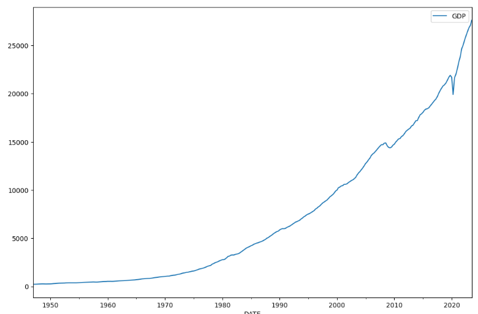
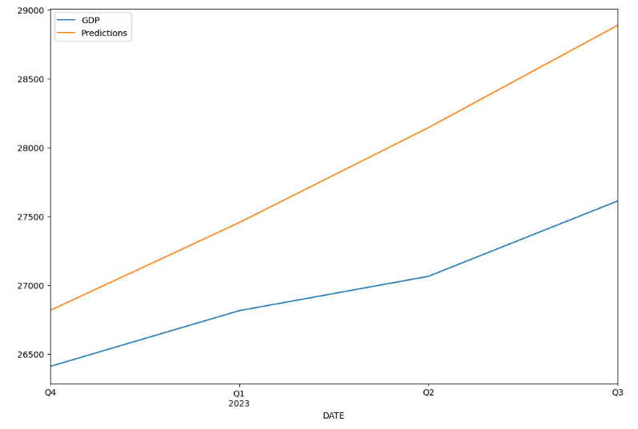

<h1 align="center">

</h1> 

# Gross Domestic Product Analysis using Time Series

  

This project utilizes Recurrent Neural Networks (RNNs) to analyze and forecast the Gross Domestic Product (GDP) trends based on data from the FRED Economic Data St. Louis Database. It specifically explores how GDP has evolved over time and applies advanced time series analysis techniques to predict future economic scenarios. With the backdrop of the IMF's 2023 projection of a global GDP reaching $105 trillion, this analysis becomes crucial for understanding potential growth trajectories and economic resilience in varying global conditions.
  

<h1 align="center">

</h1> 

## 🔑 Key Feature

### Time Series Analysis:
Implements RNNs to capture the sequential dependency across quarterly GDP data, highlighting trends and potential cyclic behavior.  

### Data Preprocessing:

Cleans and prepares time series data, ensuring quality and consistency for effective model training.
  

### Seasonal Decomposition:
Breaks down the GDP data into trend, seasonal, and residual components, allowing for a nuanced understanding of underlying patterns.
  

### Feature Engineering:
Enhances the dataset with features derived from raw time series data, improving the model's learning capability.
  

### GDP Forecasting:

Employs neural networks to forecast GDP for upcoming quarters, providing insights into future economic conditions.
  

## 🧠 Skills
- Python
- Time Series Analysis
- Recurrent Neural Networks
- Data Visualization
- Statistical Modeling
- Keras
- TensorFlow

## ⚙️ Future Work
- Enhance Forecasting Models: Explore more sophisticated neural network architectures like LSTM and GRU to improve accuracy and reduce forecasting errors.
- Expand Economic Indicators: Integrate additional economic indicators such as inflation rates, unemployment rates, and consumer indexes to create a more robust model.
- Real-Time Data Integration: Develop a system to ingest real-time economic data, allowing for more dynamic and timely GDP forecasts.

